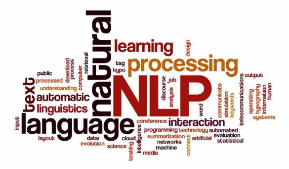
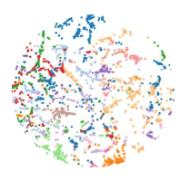

# Procesamiento de lenguaje natural

Procesamiento de lenguaje natural (NLP) - UBA (Universidad Nacional de Buenos Aires) - Desafíos

## Desafío 1: Vectorización de texto y Modelo Naïve Bayes
Clasificación de texto utilizando el dataset 20 Newsgroups, categorizado en 20 grupos de discusión.

\
**Objetivos**:
- **Carga de Datos**: Uso del dataset preprocesado de sklearn.
- **Vectorización**: Aplicación de TfidfVectorizer para representar texto en una matriz documento-término.
- **Clasificación**: Entrenamiento de modelos Naïve Bayes (MultinomialNB y ComplementNB).
- **Evaluación**: Medición del rendimiento con F1-score.

Colab: [Desafío 1](https://github.com/Kajachuan/nlp/blob/main/desafio%201/Desafio_1.ipynb)

## Desafío 2: Custom Embeddings con Gensim
Creación de embeddings personalizados con Gensim basados en el corpus de los dos libros de "El ingenioso hidalgo don Quijote de la Mancha".

\
**Objetivos**:
- **Generación de Embeddings**: Entrenamiento de embeddings con Word2Vec.
- **Preprocesamiento**: Tokenización y estructuración del corpus.
- **Entrenamiento**: Construcción de representaciones vectoriales de palabras.
- **Evaluación y Visualización**: Análisis semántico de palabras con embeddings.

Colab: [Desafío 2](https://github.com/Kajachuan/nlp/blob/main/desafio%202/Desafio_2.ipynb)

## Desafío 3: Modelo de Lenguaje con Tokenización por Palabras
Exploración de un modelo de lenguaje basado en tokenización por palabras utilizando RNNs y el corpus del primer libro de "El ingenioso hidalgo don Quijote de la Mancha".

\
**Objetivos**:
- **Preprocesamiento**: Tokenización y creación de secuencias.
- **Modelado**: Implementación de SimpleRNN, LSTM, y GRU.
- **Generación de Secuencias**: Uso de técnicas como greedy search y beam search.
- **Evaluación**: Medición de perplejidad y comparación de arquitecturas.

Colab: [Desafío 3](https://github.com/Kajachuan/nlp/blob/main/desafio%203/desafio_3_modelo_lenguaje_word.ipynb)

## Desafío 4: LSTM Bot QA
Construcción de un bot basado en un modelo encoder-decoder utilizando LSTM para responder preguntas.

\
**Objetivos**:
- **Preprocesamiento**: Tokenización y creación de diccionarios para mapping.
- **Embeddings**: Uso de embeddings pre-entrenados (GloVe).
- **Modelado**: Diseño de encoder-decoder con LSTM.
- **Inferencia**: Evaluación de respuestas generadas para secuencias del dataset.

Colab: [Desafío 4](https://github.com/Kajachuan/nlp/blob/main/desafio%204/desafio_4_bot_qa.ipynb)
